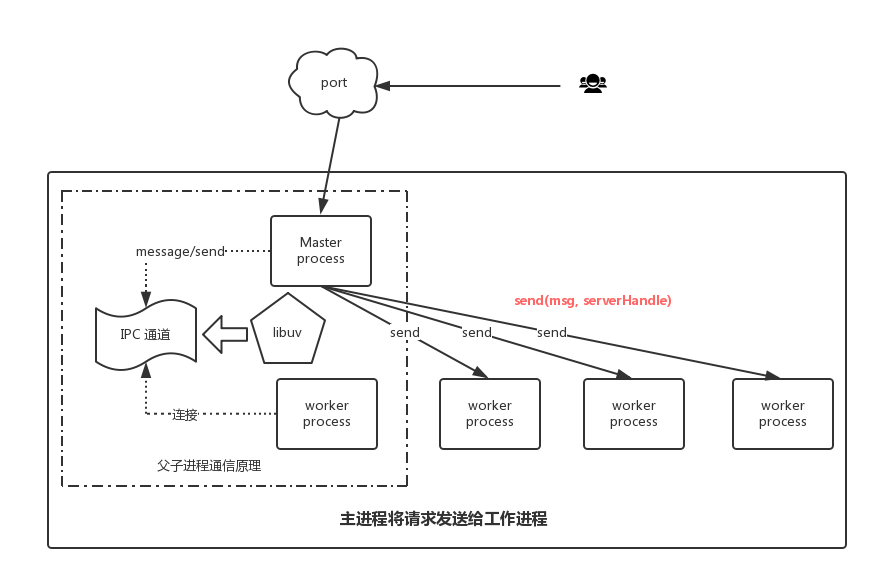

# node-cluster-workers-ipc 通行机制


Node 以单进程、JS 单线程架构运行时，由于其**异步非阻塞、事件驱动**的特性，能够同时接受大量并发请求，I/O 线程“接单”后放入事件队列中等着被事件循环处理。

## 单进程单线程的局限和 Cluster 的优势

然而，单进程下无法充分利用多核 CPU 的计算能力，造成资源浪费，而且并发数逐渐增加后，每个请求的平均处理时间会越来越长。这个阶段性能还是比较容易提升的，可以引入 Node Cluster，**用集群多进程的方式充分利用多核 CPU**。

[Clustering in NodeJs — Performance Optimization — Part I](https://medium.com/tech-tajawal/clustering-in-nodejs-utilizing-multiple-processor-cores-75d78aeb0f4f) 一文中对单线程（进程）和 Cluster 集群，多个并发请求量下的平均处理时间做了测试比较，测试数据如下图。结果表明，在 Cluster 集群下，性能（请求平均处理时间）提升了 66%。


## Cluster 实践

> cluster 模型下，master 称为主进程，fork 出来的 worker 即从进程

简单的 master - worker 模型处理 http 请求的例子：

**master.js**

```js
const cluster = require("cluster");
const numCPUs = require("os").cpus().length;

if (cluster.isMaster) {
  console.log(`Master ${process.pid} is running`);

  // Fork workers.
  for (let i = 0; i < numCPUs; i++) {
    cluster.fork();
  }

  cluster.on("exit", (worker, code, signal) => {
    console.log(`worker ${worker.process.pid} died`);
    // accidental exit, add new worker
    if (!worker.exitedAfterDisconnect) {
      cluster.fork();
    }
  });
} else {
  require("./worker");
}
```

引入了 `cluster` 模块后，根据 `cluster.isMaster` 判断当前进程是否主进程，然后 **fork** 出 worker，一般根据 CPU 数量来决定 worker 数量。如果是 worker，则引入 worker 文件执行。这里把 master 和 worker 模块分离开来，方便单独维护。

使用 `if else` 条件分支是因为执行 `fork()` 之后，worker 会以新进程的方式重新执行当前文件，所以需要根据当前进程类型执行对应的逻辑。

master 中还监听了 worker `exit` 事件，当 worker 异常退出（非 master 主动关闭，通过 `exitedAfterDisconnect` 判断）时，再重新 fork 一个 worker。

**worker.js**

```js
const http = require("http");

// Workers can share any TCP connection
// In this case it is an HTTP server
http
  .createServer((req, res) => {
    res.writeHead(200);
    res.end("hello world\n");
  })
  .listen(8000);

console.log(`Worker ${process.pid} started`);
```

worker 中负责处理 HTTP 请求和响应，**虽然 listen 同一个端口，但其实是只有 master 监听了该端口，有新的连接过来后分配给 workers 处理**。

## Cluster workers IPC

> IPC 全称是 Inter-Process Communication，即进程间通信，Node 实现 IPC 使用管道(pipe)技术，具体实现细节由 libuv 提供。在 Windows 下由命名管道（named pipe）实现，Linux 下采用 Unix Domain Socket 实现。表现在应用层上的进程间通信只有简单的 message 事件和 send() 方法。父进程在实际创建子进程之前，会创建 IPC 通道并监听它，然后才真正创建出子进程，并且通过环境变量 NODE_CHANNEL_FD 告诉子进程这个 IPC 通道的文件描述符。子进程通过这个文件描述符去连接这个已存在的 IPC 通道，从而完成父子进程之间的连接。

master 和 worker 之间可以利用 IPC 通道进行通信，通过 `process.send()` 和 `process.on('message')` 在 master 和 worker 间传递消息：

```js
// worker
process.on("message", message => {
  console.log("Message from parent:", message);
});
process.send("Message from worker");
```



但是这个 IPC 通道只存在于父子进程之间，是由 libuv 创建的，**workers 之间如果要 IPC 该怎么办呢？** 因为 workers 不适合自己来实现 IPC 互相通信，谁来连接谁呢？**所以最好是通过一个代理来实现。workers 连接代理，与代理互相发送和接收消息，代理只负责转发，这样就能达到 workers 之间 IPC 的目的**。

下面介绍两种方式来实现这个代理：

### Unix Domain Socket IPC

通过 Node `net.createServer()` 可以创建 Unix domain socket server，监听本地文件句柄来实现本地跨进程通信。Unix domain socket server 开始监听后，wrokers 通过 `net.connect()` 创建 client socket 连接到 server socket，Unix domain socket 是全双工的，因此双方都可以使用`send()`和`recv()`来进行数据的收发。

> 想深入了解 net 和 Unix domain socket 推荐阅读：
>
> [一个使用 unix domain socket 进行 IPC 的小例子](https://cnodejs.org/topic/5ae1f5da39a81e4548f45741)
>
> [深入学习 Node.js Net](https://semlinker.com/node-net/)

某个 worker 想要跟其它 worker 同步数据时，首先调用 `send()` 发送数据给 server socket，server socket 通过 `recv()` 接收到消息后转发到对应的 workers，实现了 workers 数据同步。

跟 master - worker 提供的 IPC API 不同，这种方式需要我们自己实现 Node IPC 的细节，管理数据通信，成本较高。

[Pandora.js 进程间通信](https://midwayjs.org/pandora/zh-cn/guide/process/ipc_hub.html#%E7%9B%B4%E6%8E%A5%E5%8F%91%E5%B8%83%E5%AF%B9%E8%B1%A1%E5%92%8C%E8%8E%B7%E5%8F%96%E5%AF%B9%E8%B1%A1%E4%BB%A3%E7%90%86) 就是使用了 Unix Domain Socket IPC 来实现跨进程访问、调用。

> Pandora.js 创建 Unix Domain Socket 的源码：
>
> [Pandora messenger base](https://github.com/midwayjs/pandora/blob/f9089637c15f6a3070cc601abb7744bc42f229aa/packages/messenger/src/base.ts#L37)
>
> [Pandora messenger server](https://github.com/midwayjs/pandora/blob/f9089637c15f6a3070cc601abb7744bc42f229aa/packages/messenger/src/server.ts#L28)

还有 [node-ipc](https://github.com/RIAEvangelist/node-ipc) 这个 node 模块封装了通用的 IPC API，虽然不再维护了，但下载量挺高的，不妨一试。

### Master 代理

Unix domain socket 实现 IPC 专职负责 workers IPC 代理，虽然自由度更高，能灵活控制 IPC 细节，但相应的会增加开发维护成本。如果只需要简单的 workers IPC ，完全可以让 master 代理，通过 master - worker IPC 提供的 API 快速实现。


**Egg.js** [进程间通信](https://eggjs.org/zh-cn/core/cluster-and-ipc.html)也介绍了这种方式，如果想要在所有 workers 之间同步，可以通过 **Agent** 来广播，如果想要在指定的 workers 间通信，就通过 master 来转发。

```
广播消息： agent => all workers
                  +--------+          +-------+
                  | Master |<---------| Agent |
                  +--------+          +-------+
                 /    |     \
                /     |      \
               /      |       \
              /       |        \
             v        v         v
  +----------+   +----------+   +----------+
  | Worker 1 |   | Worker 2 |   | Worker 3 |
  +----------+   +----------+   +----------+

指定接收方： one worker => another worker
                  +--------+          +-------+
                  | Master |----------| Agent |
                  +--------+          +-------+
                 ^    |
     send to    /     |
    worker 2   /      |
              /       |
             /        v
  +----------+   +----------+   +----------+
  | Worker 1 |   | Worker 2 |   | Worker 3 |
  +----------+   +----------+   +----------+
```

#### IP 限流例子

现在通过 Master 代理的方式来实现一个 Cluster 模式下 IP 限流的例子，目的是在 workers 间对同一个 IP 的请求次数做限制，超过请求阈值后就响应错误。**这就要求 workers 间同步每个 IP 的请求次数，这里通过 master 来代理 workers IPC**。

##### worker.js

worker 会在处理请求时记录当前的 IP，并向 master 发送消息同步给其它 workers，如果当前 IP 的累计请求数量超过阈值，则响应 400。

worker 会监听 master 的 `message` 消息，当接收到其它 workers 发来的 IP 同步消息时，就增加当前进程记录的 IP 请求数。

```js
const http = require("http");

// record the number of IP requests
const ipRecord = {};
const MAX_REQUEST = 3;

// Workers can share any TCP connection
// In this case it is an HTTP server
http
  .createServer((req, res) => {
    const realIP =
      req.headers["x-forwarded-for"] || req.connection.remoteAddress;

    realIP && syncRequest(realIP);
    if (realIP && ipRecord[realIP] > MAX_REQUEST) {
      console.warn(
        `[${process.pid}] IP: ${realIP} exceeded the maximum request quantity!`
      );
      res.writeHead(400).end("Too many requests!");
      return;
    }

    res.writeHead(200).end("hello world\n");
  })
  .listen(8000);

// increase ip request number when notified by other workers
process.on("message", message => {
  if (message.action === "SYNC_REQUEST") {
    ipRecord[message.ip] = (ipRecord[message.ip] || 0) + 1;
  }
});

// increase ip request number and notify other workers
function syncRequest(ip) {
  ipRecord[ip] = (ipRecord[ip] || 0) + 1;
  process.send({
    action: "SYNC_REQUEST",
    ip
  });
}

console.log(`Worker ${process.pid} started`);
```

##### master.js

master 在 fork worker 后同时监听了该 worker 的 `message` 消息，当一个 worker 希望跟其它 workers 同步 IP 请求时，master 会负责将消息转发给其它 workers，达到了 workers IPC 的目的。

```js
const cluster = require("cluster");
const numCPUs = require("os").cpus().length;

if (cluster.isMaster) {
  console.log(`Master ${process.pid} is running`);

  // Fork workers.
  for (let i = 0; i < numCPUs; i++) {
    const worker = cluster.fork();
    worker.on("message", message => {
      // proxy workers IPC
      if (message.action === "SYNC_REQUEST") {
        sendToOhterWorkers(worker.id, message);
      }
    });
  }

  cluster.on("exit", (worker, code, signal) => {
    console.log(`worker ${worker.process.pid} died`);
    // accidental exit, add new worker
    if (!worker.exitedAfterDisconnect) {
      cluster.fork();
    }
  });

  function sendToOhterWorkers(workerSender, message) {
    for (const id in cluster.workers) {
      if (+id !== workerSender) {
        cluster.workers[id].send(message);
      }
    }
  }
} else {
  require("./worker");
}
```

##### 测试

启动 **master.js**，workers 开始监听本地 8000 端口 HTTP 请求：

```shell
node master.js
Master 63657 is running
Worker 63658 started
Worker 63659 started
Worker 63660 started
...
```

使用 `curl` 命令设置 `X-Forwarded-For` header，模拟不同 IP 请求。首先模拟 `0.0.0.0` IP 连续发送 3 次请求，请求阈值设置为 3：

```shell
curl --header "X-Forwarded-For: 0.0.0.0" -i localhost:8000
curl --header "X-Forwarded-For: 0.0.0.0" -i localhost:8000
curl --header "X-Forwarded-For: 0.0.0.0" -i localhost:8000

HTTP/1.1 200 OK
hello world
```

IP `0.0.0.0` 发送第 4 次请求时，因为超过了阈值，会被某个 worker 响应 400，后面再用此 IP 发送请求到 workers，都会响应 400，因为请求数在 workers 间是同步的：

```shell
curl --header "X-Forwarded-For: 0.0.0.0" -i localhost:8000

HTTP/1.1 400 Bad Request
Too many requests!
```

node 不同 worker 进程打印 warn 日志：

```shell
[65097] IP: 0.0.0.0 exceeded the maximum request quantity!
[65100] IP: 0.0.0.0 exceeded the maximum request quantity!
```

再模拟其它 IP 请求，正常响应：

```shell
curl --header "X-Forwarded-For: 0.0.0.1" -i localhost:8000

HTTP/1.1 200 OK
hello world
```

测试结果说明，这个例子能简单实现 cluster workers IPC 同步 IP 请求数量，进行 IP 限流。

##### 并发测试

上面是用顺序的 HTTP 请求测试，本例中的 Node 服务能顺利处理串行的 IP 请求限流，下面尝试在**并发**请求条件下，是否还能按照预期处理？

使用 Apache 压力测试工具 `ab` 来测试并发的 HTTP 请求：

```shell
ab -H 'x-forwarded-for: 0.0.0.2' -n 10 -c 5 localhost:8000/
```

发送 10 次请求，并发数为 5，在理想情况下，应该只有前 3 次请求成功，后面 7 次都会失败。实际结果往往很骨感：

```
Concurrency Level:      5
Complete requests:      10
Failed requests:        4
Non-2xx responses:      4
```

`ab` 的测试结果中，可以看到失败的请求数是 4，说明有 6 次请求成功了，跟预期不符。因为在并发情况下，多个 workers 同时处理 HTTP 请求，可能在 workers 同步并接收到 IP 请求消息前，当前的 HTTP 请求已经处理完响应了。这是 IPC 异步导致的问题，而判断是否超过阈值的逻辑又是同步的，所以会有漏网之鱼逃过了限流。

##### 存在的问题

严格来说，workers 间需要实时同步的状态不应该由 worker 自己管理，而是交由第三方来管理共享状态，worker 只负责发送更新指令和获取状态，这个第三方可能是 master 或者 Redis 等，同时判断超过阈值的逻辑也应该是异步获取完当前状态再执行。

本例中也还有一些问题存在，比如：

- 一个 worker 被 kill 掉，master 再重新 fork 出来的新 worker，IP 记录请求数是从 0 开始计数的，某个被限流的 IP 如果被转发到这个 worker 上处理，会侥幸逃过一劫；

- 所有的 workers IPC 都由 master 代理，会加重 master 的处理负担，流量增长后可能会出现性能问题；

- 某个 IP 被限流后，后面的每次请求都会在 workers 间继续同步计数，有点多余；

- …

#### [clusterhub](https://github.com/fent/clusterhub) 模块

上面的 master 代理 workers IPC 也有库可以支持，[clusterhub](https://github.com/fent/clusterhub) 这个 Node 模块提供了 **EventEmitter** 的方式来让 master 代理 workers IPC，实际项目中可以引入这个模块。

现在就来试一下用 **clusterhub** 模块改写上面的例子：

##### master.js

master 中就可以移除上面转发消息的逻辑，但是一定要引入 **clusterhub** 模块，即使 master 中不调用 **clusterhub** API，因为 **clusterhub** 内部要在 master 进程中注册代理的逻辑。

```js
const cluster = require("cluster");
const numCPUs = require("os").cpus().length;
// 注意引入 clusterhub
require("clusterhub");

if (cluster.isMaster) {
  console.log(`Master ${process.pid} is running`);

  // Fork workers.
  for (let i = 0; i < numCPUs; i++) {
    cluster.fork();
  }

  cluster.on("exit", (worker, code, signal) => {
    console.log(`worker ${worker.process.pid} died`);
    // accidental exit, add new worker
    if (!worker.exitedAfterDisconnect) {
      cluster.fork();
    }
  });
} else {
  require("./worker");
}
```

##### worker.js

worker 中就不需要监听 `process message` 事件了，直接在 **hub** 上监听 `SYNC_REQUEST` 事件，与其它 workers 同步 IP 时调用 `hub.emitRemote()`，**clusterhub** 会在内部封装信息发送给 master，master 再转发给其它 workers。

```js
const http = require("http");
const hub = require("clusterhub");

const ipRecord = {};
const MAX_REQUEST = 3;

// Workers can share any TCP connection
// In this case it is an HTTP server
http
  .createServer((req, res) => {
    const realIP =
      req.headers["x-forwarded-for"] || req.connection.remoteAddress;

    realIP && syncRequest(realIP);
    if (realIP && ipRecord[realIP] > MAX_REQUEST) {
      console.warn(
        `[${process.pid}] IP: ${realIP} exceeded the maximum request quantity!`
      );
      res.writeHead(400).end("Too many requests!");
      return;
    }

    res.writeHead(200).end("hello world\n");
  })
  .listen(8000);

// listen SYNC_REQUEST on hub
hub.on("SYNC_REQUEST", ip => {
  ipRecord[ip] = (ipRecord[ip] || 0) + 1;
});

// increase ip request number and notify other workers by hub.emitRemote()
function syncRequest(ip) {
  ipRecord[ip] = (ipRecord[ip] || 0) + 1;
  hub.emitRemote("SYNC_REQUEST", ip);
}

console.log(`Worker ${process.pid} started`);
```

测试结果同上。**clusterhub** 省去了我们手动实现 master 代理逻辑的流程，还提供在当前进程触发事件的 API [clusterhub.emitLocal()](https://github.com/fent/clusterhub#hubemitlocalevent-args) 。另外 **clusterhub** 引入了 [EventVat](https://github.com/hij1nx/EventVat) 作为跨进程的 key-value 数据库，这不就是前面提到的第三方状态管理吗？

事情变得更简单了，直接把 IP 请求记录存到 master - workers 共享的 key-value DB 里，每次处理 IP 请求时，首先从 DB 异步获取到当前 IP 累计请求数，然后再决定是否限流；虽然增加了 HTTP 处理延迟，但在逻辑上提高了准确率和合理性。

```js
const http = require("http");
const hub = require("clusterhub");

const MAX_REQUEST = 100;

// Workers can share any TCP connection
// In this case it is an HTTP server
http
  .createServer((req, res) => {
    const realIP =
      req.headers["x-forwarded-for"] || req.connection.remoteAddress;

    // increment the IP integer value in key-value db
    realIP && hub.incr(realIP);

    // first get the IP integer value asynchronously, then decide whether to limit
    hub.get(realIP, count => {
      if (count > MAX_REQUEST) {
        console.warn(
          `[${process.pid}] IP: ${realIP} exceeded the maximum request quantity!`
        );
        res.writeHead(400).end("Too many requests!");
        return;
      }
      res.writeHead(200).end("hello world\n");
    });
  })
  .listen(8000);

console.log(`Worker ${process.pid} started`);
```

##### 测试

`ab` 命令设置在 1000 请求数，并发 100 的条件下，对阈值为 100 的例子进行测试：

```shell
ab -H 'x-forwarded-for: 0.0.0.5' -n 1000 -c 100 localhost:8000/

Concurrency Level:      100
Time taken for tests:   0.244 seconds
Complete requests:      1000
Failed requests:        900
```

测试结果表示只有 100 个请求成功了，说明符合预期。

## 总结

本文首先介绍了 Node Cluster 相比 Node 单进程的优势，并展示了 Cluster 的简单实践，然后引出 cluster workers IPC 的问题，给出两种实现方式：

- Unix Domain Socket IPC
- Master 代理

基于 Master 代理方式实践了一个 IP 限流的例子，指出存在的问题（并发、异步、共享状态管理），最后引入 **clusterhub** 模块做优化，初步解决了提到的问题。

libuv 创建的 master - worker IPC 为 workers IPC 提供了一条捷径。


